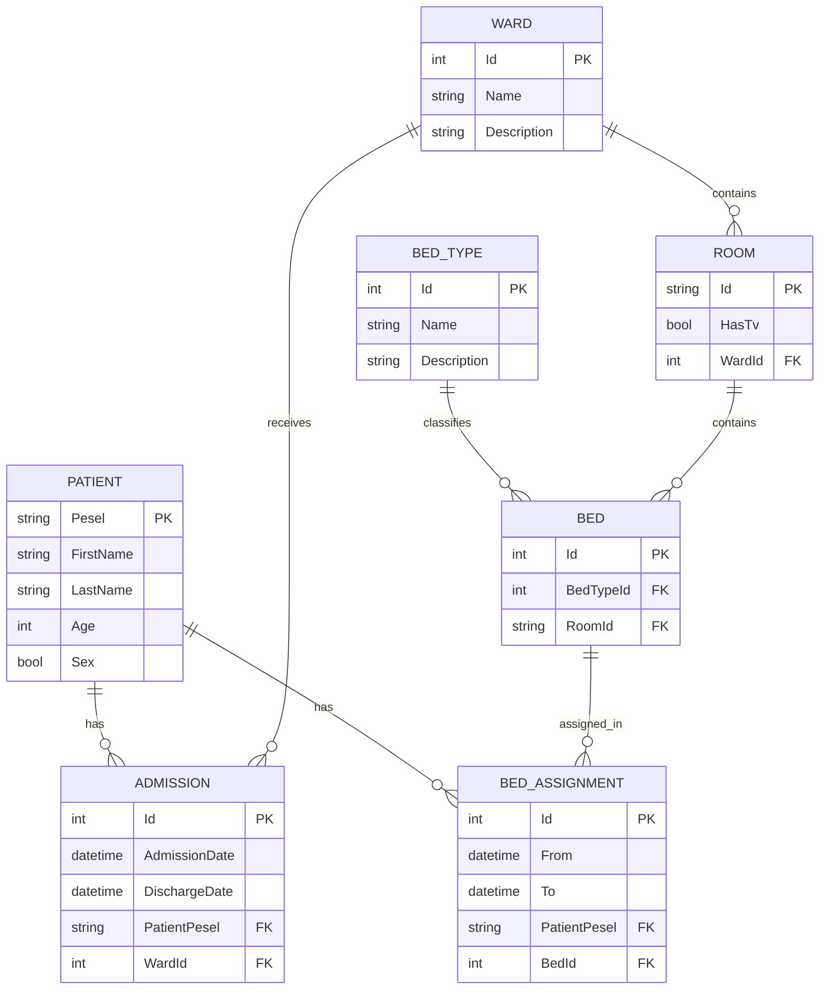

# Hospital API

A REST API for managing hospital patients, admissions, and bed assignments.

The project allows you to:

* retrieve patients together with their admission and bed-assignment history;
* search for patients by first name or last name;
* assign an available bed of the required type in a selected ward;
* check whether a bed is available during a specified period;
* browse and test the API through Swagger UI.

## Features

### Retrieving Patients

The API returns patients together with related data:

* PESEL;
* first name and last name;
* age;
* sex;
* admission history;
* wards in which the patient was admitted;
* bed-assignment history;
* bed type;
* room;
* information about whether the room has a TV;
* the ward to which the room belongs.

### Searching for Patients

The patient list can be filtered by a partial match against:

* first name;
* last name.

### Assigning a Bed

A new bed assignment can be created for a patient by specifying:

* the start date;
* an optional end date;
* the bed type;
* the ward.

Before creating the assignment, the API verifies:

1. that the request data is valid;
2. that the patient exists;
3. that the specified bed type exists;
4. that the specified ward exists;
5. that the selected bed has no overlapping assignments.

## Technology Stack

| Component                | Technology                                |
| ------------------------ | ----------------------------------------- |
| Platform                 | .NET 10                                   |
| Web framework            | ASP.NET Core Web API                      |
| ORM                      | Entity Framework Core 10                  |
| Database                 | Microsoft SQL Server                      |
| Database provider        | `Microsoft.EntityFrameworkCore.SqlServer` |
| API documentation        | OpenAPI                                   |
| Documentation UI         | Swagger UI                                |
| Dependency injection     | Built-in ASP.NET Core container           |
| Asynchronous programming | `async` / `await`, `CancellationToken`    |

## Architecture

The project uses a simple separation of responsibilities:

```text
HTTP request
    │
    ▼
PatientsController
    │
    ▼
IPatientService / PatientService
    │
    ▼
MasterContext
    │
    ▼
SQL Server
```

Main layers:

* **Controllers** — receive HTTP requests and produce HTTP responses.
* **Services** — contain application business logic.
* **Infrastructure** — contains the Entity Framework Core `DbContext` and its configuration.
* **Models** — represent database entities.
* **DTOs** — represent API request and response models.

## Project Structure

```text
Hospital-Api/
└── HospitalApi/
    ├── Controllers/
    │   └── PatientsController.cs
    ├── DTOs/
    │   ├── AdmissionDto.cs
    │   ├── AssignBedRequestDto.cs
    │   ├── BedAssignmentDto.cs
    │   ├── BedDto.cs
    │   ├── BedTypeDto.cs
    │   ├── PatientDto.cs
    │   ├── RoomDto.cs
    │   └── WardDto.cs
    ├── Infrastructure/
    │   └── MasterContext.cs
    ├── Models/
    │   ├── Admission.cs
    │   ├── Bed.cs
    │   ├── BedAssignment.cs
    │   ├── BedType.cs
    │   ├── Patient.cs
    │   ├── Room.cs
    │   └── Ward.cs
    ├── Properties/
    │   └── launchSettings.json
    ├── Services/
    │   ├── IPatientService.cs
    │   ├── PatientService.cs
    │   └── ServiceResult.cs
    ├── appsettings.json
    ├── appsettings.Development.json
    ├── HospitalApi.csproj
    └── Program.cs
```

## Data Model



## Requirements

The following tools are required to run the project locally:

* [.NET 10 SDK](https://dotnet.microsoft.com/download);
* Microsoft SQL Server or SQL Server LocalDB;
* Git;
* a database containing tables that match the project models.

For HTTPS development, it is also recommended to trust the local development certificate:

```bash
dotnet dev-certs https --trust
```

> SQL Server LocalDB is available only on Windows. On Linux or macOS, use a regular SQL Server instance, SQL Server in Docker, or another compatible SQL Server installation.

## Installation and Running

### 1. Clone the Repository

```bash
git clone https://github.com/IvRom201/Hospital-Api.git
cd Hospital-Api/HospitalApi
```

### 2. Restore Dependencies

```bash
dotnet restore
```

### 3. Configure the Database Connection

Update the connection string in `appsettings.json`.

Example for SQL Server LocalDB:

```json
{
  "ConnectionStrings": {
    "DefaultConnection": "Data Source=(localdb)\\MSSQLLocalDB;Initial Catalog=HospitalDb;Integrated Security=True;TrustServerCertificate=True;"
  }
}
```

Example for a local SQL Server instance:

```json
{
  "ConnectionStrings": {
    "DefaultConnection": "Server=localhost;Database=HospitalDb;User Id=sa;Password=YourStrongPassword123!;TrustServerCertificate=True;"
  }
}
```

### 4. Build the Project

```bash
dotnet build
```

### 5. Run the Application

Using the HTTPS launch profile:

```bash
dotnet run --launch-profile https
```

Application addresses:

```text
https://localhost:7057
http://localhost:5184
```

Swagger UI:

```text
https://localhost:7057/swagger
```

OpenAPI JSON:

```text
https://localhost:7057/openapi/v1.json
```

## Database Configuration

### Important Connection String Note

In the current version of the project, the SQL Server connection is configured in two places:

1. `HospitalApi/appsettings.json`;
2. the `OnConfiguring` method in `HospitalApi/Infrastructure/MasterContext.cs`.

Because of this, changing only `appsettings.json` may not be sufficient.

The recommended approach is to remove the hard-coded connection string from `MasterContext` and keep the Dependency Injection configuration in `Program.cs`.

Instead of:

```csharp
protected override void OnConfiguring(DbContextOptionsBuilder optionsBuilder)
    => optionsBuilder.UseSqlServer(
        "Data Source=(localdb)\\MSSQLLocalDB;Initial Catalog=master;Integrated Security=True;");
```

you can use:

```csharp
protected override void OnConfiguring(DbContextOptionsBuilder optionsBuilder)
{
    if (!optionsBuilder.IsConfigured)
    {
        // Configuration is supplied through Program.cs.
    }
}
```

Alternatively, remove the `OnConfiguring` override completely if the context is always created by the dependency injection container.

> Using the system `master` database for application data is not recommended. Create a separate database such as `HospitalDb`.

### Database Schema

The repository does not contain:

* EF Core migrations;
* an SQL script for creating tables;
* automatic test-data seeding.

Before starting the API, the database must already contain the following tables:

```text
Patients
Admissions
Wards
Rooms
Beds
BedTypes
BedAssignments
```

The bed type and ward names sent to the API must already exist in the `BedTypes` and `Wards` tables.

## OpenAPI and Swagger

OpenAPI and Swagger UI are available only in the `Development` environment.

The profiles in `launchSettings.json` automatically set:

```text
ASPNETCORE_ENVIRONMENT=Development
```

After starting the project, open:

```text
https://localhost:7057/swagger
```

Swagger UI allows you to:

* inspect available routes;
* view request and response models;
* execute requests directly from the browser;
* inspect HTTP response codes.

## API

Controller base route:

```text
/api/Patients
```

### Endpoint Summary

| Method | Route                                  | Description                               |
| ------ | -------------------------------------- | ----------------------------------------- |
| `GET`  | `/api/Patients`                        | Retrieve all patients                     |
| `GET`  | `/api/Patients?search={value}`         | Search for patients by first or last name |
| `POST` | `/api/Patients/{pesel}/bedassignments` | Assign an available bed to a patient      |

---

### GET `/api/Patients`

Returns a list of patients together with their admissions and bed assignments.

#### Request

```http
GET /api/Patients HTTP/1.1
Host: localhost:7057
Accept: application/json
```

#### cURL

```bash
curl -k "https://localhost:7057/api/Patients"
```

#### Successful Response

Status:

```text
200 OK
```

Example:

```json
[
  {
    "pesel": "90010112345",
    "firstName": "Jan",
    "lastName": "Kowalski",
    "age": 36,
    "sex": "Male",
    "admissions": [
      {
        "id": 1,
        "admissionDate": "2026-07-20T08:30:00",
        "dischargeDate": null,
        "ward": {
          "id": 2,
          "name": "Cardiology",
          "description": "Cardiology ward"
        }
      }
    ],
    "bedAssignments": [
      {
        "id": 10,
        "from": "2026-07-20T09:00:00",
        "to": null,
        "bed": {
          "id": 15,
          "bedType": {
            "id": 1,
            "name": "Standard",
            "description": "Standard hospital bed"
          },
          "room": {
            "id": "A101",
            "hasTv": true,
            "ward": {
              "id": 2,
              "name": "Cardiology",
              "description": "Cardiology ward"
            }
          }
        }
      }
    ]
  }
]
```

The `sex` field is generated as follows:

| Model value | API value  |
| ----------- | ---------- |
| `true`      | `"Male"`   |
| `false`     | `"Female"` |

---

### GET `/api/Patients?search={value}`

Filters patients by a partial first-name or last-name match.

#### Query Parameters

| Parameter | Type     | Required | Description                                   |
| --------- | -------- | -------: | --------------------------------------------- |
| `search`  | `string` |       no | Part of the patient's first name or last name |

#### Example Request

```bash
curl -k "https://localhost:7057/api/Patients?search=Kow"
```

The SQL search uses `LIKE`:

```text
%Kow%
```

If the parameter is missing, empty, or contains only whitespace, all patients are returned.

#### Successful Response

```text
200 OK
```

The response body has the same format as `GET /api/Patients`.

---

### POST `/api/Patients/{pesel}/bedassignments`

Creates a new available-bed assignment for a patient.

#### Path Parameters

| Parameter | Type     | Description                  |
| --------- | -------- | ---------------------------- |
| `pesel`   | `string` | PESEL of an existing patient |

#### Request Body

| Field     | Type               | Required | Description                    |
| --------- | ------------------ | -------: | ------------------------------ |
| `from`    | `datetime`         |      yes | Assignment start date and time |
| `to`      | `datetime \| null` |       no | Assignment end date and time   |
| `bedType` | `string`           |      yes | Bed type name                  |
| `ward`    | `string`           |      yes | Ward name                      |

#### Validation Rules

* `from` must be provided;
* when provided, `to` must be later than `from`;
* `bedType` must not be empty;
* `ward` must not be empty;
* a patient with the provided PESEL must exist;
* the bed type must exist;
* the ward must exist;
* an available bed of the selected type must exist in the selected ward;
* the requested assignment period must not overlap an existing assignment for the same bed.

#### Example Request

```bash
curl -k -X POST \
  "https://localhost:7057/api/Patients/90010112345/bedassignments" \
  -H "Content-Type: application/json" \
  -H "Accept: application/json" \
  -d '{
    "from": "2026-07-24T10:00:00",
    "to": "2026-07-30T12:00:00",
    "bedType": "Standard",
    "ward": "Cardiology"
  }'
```

For an assignment without a known end date:

```json
{
  "from": "2026-07-24T10:00:00",
  "to": null,
  "bedType": "Standard",
  "ward": "Cardiology"
}
```

#### Successful Response

Status:

```text
201 Created
```

Example:

```json
{
  "id": 11,
  "from": "2026-07-24T10:00:00",
  "to": "2026-07-30T12:00:00",
  "bed": {
    "id": 15,
    "bedType": {
      "id": 1,
      "name": "Standard",
      "description": "Standard hospital bed"
    },
    "room": {
      "id": "A101",
      "hasTv": true,
      "ward": {
        "id": 2,
        "name": "Cardiology",
        "description": "Cardiology ward"
      }
    }
  }
}
```

#### Possible Responses

| Status            | Reason                                                         |
| ----------------- | -------------------------------------------------------------- |
| `201 Created`     | The assignment was created successfully                        |
| `400 Bad Request` | Request body validation failed                                 |
| `404 Not Found`   | The patient, bed type, ward, or an available bed was not found |

## Error Format

Business-logic errors are returned in a consistent format:

```json
{
  "status": 404,
  "message": "Patient with PESEL '90010112345' was not found."
}
```

### Error Examples

#### Missing `from` Field

```json
{
  "status": 400,
  "message": "Field 'from' is required."
}
```

#### Invalid Period

```json
{
  "status": 400,
  "message": "Field 'to' must be later than field 'from'."
}
```

#### Missing Bed Type

```json
{
  "status": 400,
  "message": "Field 'bedType' is required."
}
```

#### Missing Ward

```json
{
  "status": 400,
  "message": "Field 'ward' is required."
}
```

#### Patient Not Found

```json
{
  "status": 404,
  "message": "Patient with PESEL '90010112345' was not found."
}
```

#### Bed Type Not Found

```json
{
  "status": 404,
  "message": "Bed type 'Standard' was not found."
}
```

#### Ward Not Found

```json
{
  "status": 404,
  "message": "Ward 'Cardiology' was not found."
}
```

#### Available Bed Not Found

```json
{
  "status": 404,
  "message": "No free bed of type 'Standard' was found in ward 'Cardiology' for the selected period."
}
```

## Bed Assignment Logic

The service creates an assignment in the following order:

1. Validates the request body.
2. Checks whether the patient exists by PESEL.
3. Checks whether the bed type exists by exact name.
4. Checks whether the ward exists by exact name.
5. Selects beds of the requested type in the requested ward.
6. Excludes beds whose assignments overlap the requested period.
7. Sorts suitable beds by `Bed.Id`.
8. Selects the first available bed.
9. Creates a `BedAssignment` record.
10. Returns the created assignment with `201 Created`.

Two periods are considered overlapping when:

```text
existing.From < requested.To
AND
(existing.To IS NULL OR requested.From < existing.To)
```

If `to` is not provided, the period is treated as open-ended and the maximum possible date is used during availability checks.

## Development Commands

### Restore Packages

```bash
dotnet restore
```

### Build

```bash
dotnet build
```

### Run

```bash
dotnet run --project HospitalApi/HospitalApi.csproj
```

When running the command from the `HospitalApi` directory:

```bash
dotnet run
```

### Run with a Specific Launch Profile

```bash
dotnet run --launch-profile https
```

or:

```bash
dotnet run --launch-profile http
```

### Run in Watch Mode

```bash
dotnet watch run
```

### Clean Build Output

```bash
dotnet clean
```

## Current Limitations

The project currently does not include:

* user authentication or authorization;
* staff roles;
* API operations for creating, updating, or deleting patients;
* separate CRUD endpoints for wards, rooms, beds, and bed types;
* patient-list pagination;
* sorting through query parameters;
* centralized exception handling;
* business-operation logging;
* automated tests;
* a Dockerfile;
* Docker Compose;
* EF Core migrations;
* SQL scripts for database creation and seeding;
* CI/CD;
* an explicitly declared license.

Additional limitations:

* patient search is limited to first name and last name;
* bed type and ward names are matched by exact value;
* the available bed is selected automatically;
* clients cannot provide a specific `bedId`;
* concurrent requests for the same bed may cause a race condition unless database-level constraints or transactions prevent it;
* the current connection string points to the system `master` database;
* Swagger UI is enabled only in the `Development` environment.

## Possible Improvements

* Create a separate `HospitalDb` database.
* Remove the connection string from `MasterContext`.
* Add EF Core migrations.
* Add SQL seed data.
* Add global exception handling.
* Use Problem Details for API errors.
* Add FluentValidation or Data Annotations.
* Add JWT authentication.
* Add administrator, doctor, and nurse roles.
* Add CRUD operations for patients and reference data.
* Add pagination, sorting, and advanced filtering.
* Add an endpoint for ending an active bed assignment.
* Add optimistic concurrency or transactional locking for bed assignments.
* Add unit and integration tests.
* Add a Dockerfile and Docker Compose.
* Add GitHub Actions for building and testing.
* Add health checks.
* Add structured logging.
* Add API versioning.

Until an explicit license is added, standard copyright rights remain with the project author.
::: 
